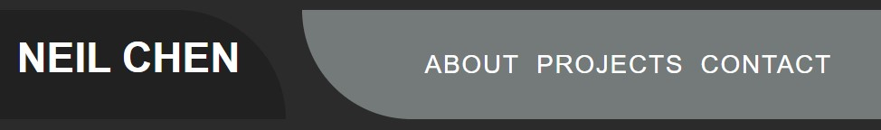
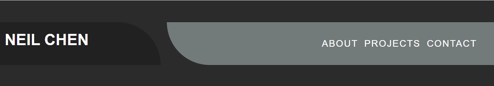
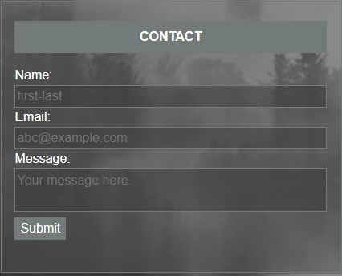

# Web Application Portfolio

## About

This is a portfolio page that I built for showcasing my deployed web applications from the Columbia Engineering Bootcamp course.

## Features

* Clean minimalistic page design.
* Projects, biographical and contact forms neatly arranged and displayed on one page.
* Fixed navigation bar.
* Hover over project titles.
* Built with mobile first design in mind, so the page is responsive to many screen widths.
* Code related aids such as:
    * Colors and borders defined by `:root` rules for easy theme changes.
    * A `reset.css` for better browser support.
* And some accessibility aids such as:
    * Strikethrough nav links for desktop browsing.
    * Brightly contrasted contact form fields when selected.

## Demos

### Responsive page demo:

### Navigation bar demo:

### Contact form demo:

## To-do

* Implemention of javascript functionality.
* Add links to deployed applications.
* Back-end development required for a functional website.

## Credits

* <a href="https://fonts.google.com/specimen/Armata">Armata</a> by Viktoriya Grabowska from Google Fonts for the headers.
* <a href="https://picsum.photos/">Lorem Picsum</a> for the placeholder images.
* Social media icons from <a href="https://www.iconfinder.com/">Iconfinder</a>.
* CSS reset file based off of the <a href="https://github.com/hankchizljaw/modern-css-reset">Modern CSS reset</a> by Andy Bell/hankchizljaw.